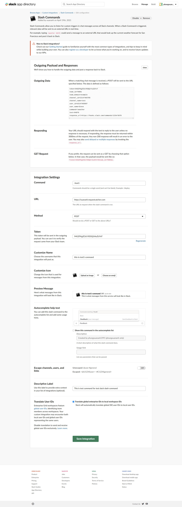

- [1. Setup slash command](#1-setup-slash-command)
- [2. How slash command work](#2-how-slash-command-work)
  - [2.1. Outgoing Data explain](#21-outgoing-data-explain)

# 1. Setup slash command

Access : https://phungxuananh.slack.com/apps

Search `slash command` or access https://phungxuananh.slack.com/apps/A0F82E8CA-slash-commands

click Add to Slack to add new slash command, then configure as below, change URL to your api or your webhook url :

# 2. How slash command work

When you enter `/test1` on any channel, slack will send data represent on [Outgoing Data](#21-outgoing-data-explain) to URL (your webhook or your api)

## 2.1. Outgoing Data explain

    token= slack token 
    team_id= id of team or company workspace
    team_domain= domain of team or company workspace
    channel_id= id of channel that you enter slash command
    channel_name= name of channel that you enter slash command
    user_id= id of user who enter slash command
    user_name= user name of user who enter slash command
    command= which command is run
    text= any text after slash command
    response_url= webhook of channel where you enter slash command

example:

    token:fEqVqEWbW12321312312321313
    team_id:TGG524NKT
    team_domain:geneticavietnam
    channel_id:C01V2FZ1WV7
    channel_name:test1
    user_id:U01UPB7EYHH
    user_name:anh.phung
    command:/test1
    text:aaaaaaa
    is_enterprise_install:false
    response_url:https://hooks.slack.com/commands/1234/5678

**NOTE:** your api can hander this message then send back to this channel any data that you want through `response_url`
