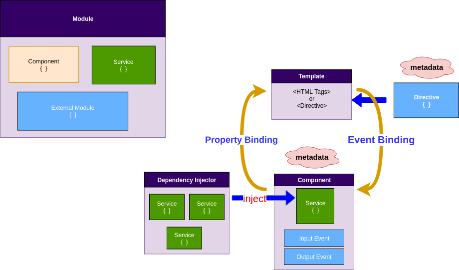
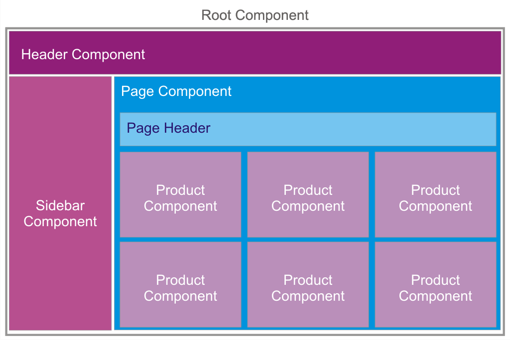
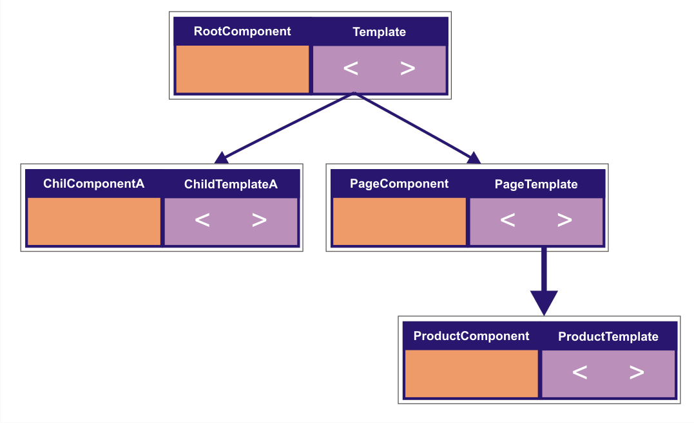
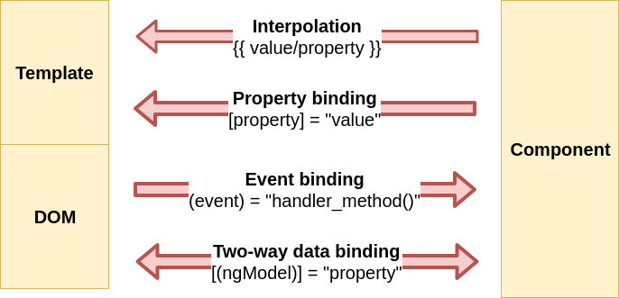
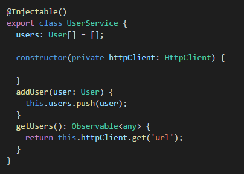
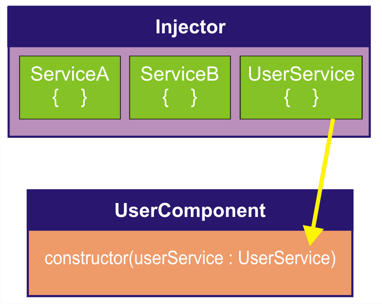

Architecture of angular
---
- [1. Overview](#1-overview)
- [2. Module](#2-module)
  - [2.1. angular library](#21-angular-library)
- [3. Components](#3-components)
- [4. Templates](#4-templates)
- [5. Data binding](#5-data-binding)
- [6. Metadata](#6-metadata)
- [7. Directives](#7-directives)
- [8. Services](#8-services)
- [9. Dependency injection](#9-dependency-injection)
- [10. Routing and Navigation](#10-routing-and-navigation)
- [11. Tham khảo](#11-tham-khảo)


# 1. Overview



https://drive.google.com/open?id=1CQWIBZKoUWoKe9NqngZUr1Rw5lLw391y

# 2. Module

- Các Angular app có tính module và Angular có hệ thống module của nó gọi là Angular module hoặc NgModules
- Mọi Angular app có ít nhất một module là root module, quy ước đặt tên là AppModule
root module có thể chỉ là module trong một ứng dụng nhỏ, phần lớn các app có nhiều features module, mỗi khối code - dùng cho 1 khu vực của ứng dụng, một workflow  or a closely related set of capabilities.
- Một angular module  có thể là một root hoặc một feature, là một class với decorator @NgModule
- NgModule là một hàm decorator lấy một đối tượng metadata có các thuộc tính mô tả module, các thuộc tính quan trong:
    - **declarations**: khai báo 1 mảng các view class thuộc về module này, có 3 kiểu view class là components, directives và pipes
    - **exports**:  tập hợp con các khai báo có thể sử dụng trong components templates hoặc trong module khác
    - **imports**: module khác mà có các class được export, các class này được sử dụng trong các component class của module này
    - **providers**: các bộ tạo (creator) của các service mà module đóng góp cho global collection services, chúng có thể được truy cập bởi tất cả các phần của app
    - **bootstrap**: the main application view, gọi là root component,  nó lưu trữ tất cả các view khác của app. Chỉ root module set trong thuộc tính này.

**app/app.module.ts**

```typescript
import{NgModule} from '@angular/core';
import {BrowserModule} from'@angular/platform-browser';
@NgModule({
	imports: [BrowserModule],
	providers: [Logger],
	declarations: [AppComponent],
	exports: [AppComponent],
	bootstrap: [AppComponent]
})
export class AppModule
{}
```

- export **AppComponent**  chỉ để show xem nó export ntn, nó không cần thiết trong ví dụ này. Một **root** module không cần export bất cứ cái gì vì các component khác không cần phải import root module 
- Chạy một app bằng cách *bootstrapping* **root module** của nó, việc này thực thiện trong file `main.ts`

**app/main.ts**

```typescript
import{platformBrowserDynamic} from '@angular/platform-browser-dynamic';
import {AppModule} from './app.module';
platformBrowserDynamic().bootstrapModule(AppModule);
```

## 2.1. angular library

- angular library có tiền tố là *@angular*, ví dụ: *@angular/core, @angular/compiler, @angular/compiler-cli, @angular/http, @angular/router*
- cài đặt bằng cách dùng **npm**
- import như sau
```typescript
import { Component } from '@angular/core';
```

# 3. Components

- Components là một khối xây dựng cơ bản của giao diện người dùng
- Một component điều khiển một đường dẫn của màn hình gọi là view. 
- Mỗi component đước map với template



- Angular app là một cây Angular component
- Ví dụ, ảnh trên, Root Component  được tải ban đầu, các component khác như Header Component, Sidebar Component, và Product Component là component con của Page Component
- Angular component class chứa:
  - Properties
  - Methods
  - Constructor
  - input events
  - output events
  - lifecycle methods: ngOnInit, ngOnDestroy

- Angular creates, updates, destroys các components khi người dùng di chuyển qua app

Ví dụ:

```typescript
import { Component, OnInit } from '@angular/core';
import { Input } from '@angular/core';
import { Output, EventEmitter } from '@angular/core';
 
@Component({
 selector: 'app-product-alerts',
 templateUrl: './product-alerts.component.html',
 styleUrls: ['./product-alerts.component.css']
})
export class ProductAlertsComponent implements OnInit {
 title = 'app';
 langs: string[] = [];
  @Input() product;
  @Output() notify = new EventEmitter();
 constructor() { }
 ngOnInit() {
 }
}
```

đoạn code trên chứa:
- properties: title, langs
- lifecycle method: ngOnInit
- input event: product
- output event: notify

Để một class sử dụng như 1 component, ta sử dụng Decorator **@Component**, các thuộc tính quan trọng của nó:
- **selector**: tên của component này, nó được sử dụng như một thẻ tag HTML để load component này. Ví dụ, để load `app-root` on screen, ta cần khai báo `<app-root></app-root>` trong HTML
- **templateUrl**: khai báo đường dẫn đến html template của component
- **template**: nếu file nội dung HTML nhỏ, không cần phải viết hẳn 1 file html template thì dùng cái này
- **styleUrls**: khai báo đường dẫn đến file CSS cho component này
- **styles**: tương tự template phía trên, không cần tạo 1 file css riêng.

# 4. Templates

Mỗi component có 1 template, nó là 1 file html bình thường, ngoại trừ 1 vài thứ linh tinh khác thêm vào như: directives, events, interpolation, data binding, và các component tag khác.
Ví dụ:

```typescript
<h2>Products</h2>
 
<div *ngFor="let product of products">
   <h3>
       <a [title]="product.name + ' details'">
           {{ product.name }}
       </a>
   </h3>
   <p *ngIf="product.description">
       Description: {{ product.description }}
   </p>
   <button (click)="share()">
       Share
   </button>
   <app-product-alerts
       [product]="product"
       (notify)="onNotify()">
   </app-product-alerts>
</div>
```

Template là một cái cây như sau:



# 5. Data binding

Angular hỗ trợ data binding cho việc điều phối giữa các phần của **template/DOM** với các phần của **component**, xem hình dưới:



Angular hỗ trợ 4 kiểu data binding sau:
- **Interpolation**: để hiển thị giá trị của các component property lên màn hình, ví dụ `{{ title }}` để hiển thị giá trị title lên màn hình
- **Property Binding**: sử dụng để update DOM property cũng như input event, ví dụ `[product]` trong đoạn code sau:  `<app-product-alerts [product]="product"> </app-product-alerts>` được dùng để update thuộc tính product của thẻ `app-product-alerts`
- **Event Binding**: dùng để tạo ra các sự kiện từ một phần tử, ví dụ sự kiện button click hoặc key up hoặc input control....Ví dụ `(click)="share()"` chính là event binding trong bộ điều khiển button, mỗi khi click button thì chạy method `share()` để xử lý sự kiện này.
- **Two-way Data Binding**: phần lớn được sử dụng khi làm việc với template-driven forms. Trong kiểu này, component property được map tới template control. dẫn tới, mỗi khi ta update giá trị trên màn hình (template), nó sẽ tự động được update trong component và ngược lại. Cú pháp của two-way data binding là  `[(ngModel)]='property'`

# 6. Metadata

Nói chung, tất cả các thành phần của Angular như component, directive, module hoặc service, chúng đều là class typescript, câu hỏi ở đây là làm thế nào Angular biết kiểu class là của thành phần nào? Câu trả lời đó là **Metadata** 

**Metadata** cho Angular biết làm thế nào xử lý một class

Trong **typescript**, chúng ta gắn **metadata** bằng cách sử dụng `@Component, @NgModule, @Injecttable, @Directive ` tương ứng với các phần trên.


# 7. Directives

Angular **Templates** là động. Khi Angular render template, nó chuyển đổi **DOM** theo chỉ thị đưa ra bởi các directive

Một **Directive** là một class với decorator `@Directive`

Angular cung cấp 2 kiểu directive:
- **Structural Directive**: directive này thay đổi cấu trúc của DOM template. Ví dụ: `*ngFor, *ngSwitch, *ngIf`
- **Attribute directive** : directive này cập nhật thuộc tính của bộ điều khiển HTML đặc biệt (specific HTML control), ví dụ: `[ngClass]`

Một component là một directive-with-a-template, bởi vì decorator `@Component` thực chất là decorator `@Directive` mở rộng với các thành phần hướng template (template-oriented features)

# 8. Services

- Các service là các class hoặc function có thể sử dụng lại, để chia sẻ giữa các component trong app.
- Để khai báo bất kỳ typescript class nào là một **Service**, sử dụng decorator `@Injectable`
- Service chủ yếu sử dụng cho các cuộc gọi đến server, hoặc thực hiện các logic.
- Bất cứ cái gì cũng có thể là một service:
  - logging service
  - data service: chia sẻ data giữa các component
  - message bus
  - tax calculator
  - application configuration
  


- Service là không đồng bộ bất biến (invariable asynchronous). Chúng ta có thể trả về dữ liệu như một lời hứa (promise) hoặc quan sát sử dụng RxJS (Observable using RxJS), như bên dưới.



Đoạn code Service trên chứa 2 method, một là `addUser()` và một là `getUsers()` sử dụng cuộc gọi HTTP get đến server

# 9. Dependency injection

- **Dependency injection** là một cách để cung cấp instance của một class mà component đó yêu cầu, mà không cần phải khởi tạo instance đó trong constructor của component
- Phần lớn các dependency là các services



Trong ví dụ trên, **UserComponent** phụ thuộc vào **UserService**

Angular sử dụng **dependency injection** để cung cấp cho các **components** với các **service** mà nó cần.
- Một **injector** giữ một bình chứa (container of) các **service instance** đã tạo ra trước đó.
- Nếu  **service instance** không có trong bình chứa, **injector** tạo một cái là thêm nó vào bình chứa trước khi trả về service này cho Angular

Trong ví dụ bên dưới, ta đăng ký một **provider** của **Firebase Service** với **injector**:
- **provider** thường là một class định nghĩa một service
- **provider** có thể được đăng ký trong **component** hoặc trong **module**
- Thường thì ta thêm **provider** vào **root module**, sau đấy thì service này có thể sử dụng bởi tất cả các thành phần khác của app, như ví dụ bên dưới:

```typescript
@NgModule({
    declarations: [
        AppComponent,
        HomeComponent,
        MoviesComponent,
        NavbarComponent,
        MovieDetailsComponent,
        AboutComponent,
        BoldTextDirective,
        MovieSearchComponent,
    ],
    imports: [
        BrowserModule,
        FormsModule,
        HttpModule,
        RouterModule.forRoot(routes),
        AngularFireModule.initializeApp(firebaseConfig,firebaseAuthConfig),
        FlashMessagesModule
    ],
    providers: [FirebaseService],
    bootstrap: [AppComponent]
})
export class AppModule { }
```
Hoặc có thể đăng ký trong **component** trong thuộc tính *providers* như bên dưới:

```typescript
import { Component } from '@angular/core';
import { FirebaseService } from './services/firebase.service';
 
@Component({
selector:'app-root',
templateUrl:'./app.component.html',
styleUrls: ['./app.component.css'],
providers: [FirebaseService]
})
export class AppComponent {
title = 'app works!';
}
```


Tham khảo thêm ở đây:
https://angular.io/guide/architecture-0services
https://angular.io/guide/dependency-injection

# 10. Routing and Navigation

https://angular.io/guide/router


# 11. Tham khảo

https://www.ngdevelop.tech/angular/architecture/
https://www.edureka.co/blog/angular-tutorial/
