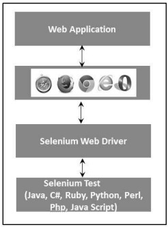

Selenium Webdriver 1: Introduce
----------------------------------
- [1. Support language](#1-support-language)
- [2. User case](#2-user-case)
- [3. Architecture](#3-architecture)
- [4. Example](#4-example)
- [5. Reference](#5-reference)

# 1. Support language

- Java
- C#
- PHP
- Python
- Perl
- Ruby

# 2. User case

- To use a specific language programming in design testcase
- To test applications that have many functions based on Ajax
- To test on browser HtmlUnit
- To create customize test results

# 3. Architecture

# 4. Example

We will access https://www.calculator.net/ to caculate the percentage, then print out result

[https://github.com/PhungXuanAnh/python-note/blob/master/selenium_sample/post_selenium_webdriver_1.py](https://github.com/PhungXuanAnh/python-note/blob/master/selenium_sample/post_selenium_webdriver_1.py)

# 5. Reference

[http://viettuts.vn/selenium/gioi-thieu-selenium-webdriver](http://viettuts.vn/selenium/gioi-thieu-selenium-webdriver)