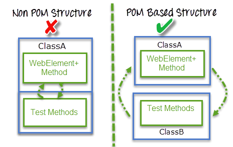

Selenium Webdriver 4: Page Object Model
--------------------------------------------
- [1. Tại sao nên sử dụng Page Object Model (POM)?](#1-tại-sao-nên-sử-dụng-page-object-model-pom)
- [2. Page Object Model (POM) là gì?](#2-page-object-model-pom-là-gì)
- [3. Ưu điểm của Page Object Model (POM)](#3-Ưu-điểm-của-page-object-model-pom)
- [4. Ví dụ Page Object Model (POM) trong Selenium](#4-ví-dụ-page-object-model-pom-trong-selenium)
- [5. Reference](#5-reference)


# 1. Tại sao nên sử dụng Page Object Model (POM)?

Page Object Model (POM) là mô hình đối tượng trang trong Selenium.

Các yêu cầu viết kịch bản test trong Selenium WebDriver KHÔNG phải là một nhiệm vụ khó khăn. Bạn chỉ cần tìm các phần tử, thực hiện các thao tác trên nó.

Hãy xem xét kịch bản đơn giản sau để đăng nhập vào một trang web.

```java
package vn.viettuts.selenium;
 
import org.openqa.selenium.By;
import org.openqa.selenium.WebDriver;
import org.openqa.selenium.chrome.ChromeDriver;
 
import junit.framework.Assert;
 
public class LoginVietTutDemo {
    public void testIsDisplayHonePage() {
        System.setProperty("webdriver.chrome.driver", 
                "D:\\SeleniumWebdriver\\chromedriver.exe");
        WebDriver driver = new ChromeDriver();
        // Open website
        driver.get("http://selenium.viettuts.vn/login");
        // Maximize the browser
        driver.manage().window().maximize();
        // find user and fill it
        driver.findElement(By.id("username")).sendKeys("admin");
        // find user and fill it
        driver.findElement(By.id("password")).sendKeys("12345678");
        // click login button
        driver.findElement(By.id("login")).click();
        String homeText = driver.findElement(
                By.xpath(".//div[@id='content']//h1")).getText();
        // verify login success
        Assert.assertEquals(homeText, "Selenium WebDriver Tuts");
    }
}
```

Như trong ví dụ trên, tất cả những gì chúng ta đang làm là tìm kiếm các phần tử và điền giá trị cho những phần tử đó.

Đây là một kịch bản nhỏ, dễ dàng bảo trì. Nhưng khi số lượng dòng code tăng lện mọi thứ trở nên khó khăn.

Vấn đề chính với việc bảo trì tập lệnh là nếu 10 tập lệnh khác nhau đang sử dụng cùng một phần tử của một trang, với bất kỳ thay đổi nào trong phần tử đó, bạn cần phải thay đổi tất cả 10 tập lệnh. Đây là thời gian và dễ bị lỗi.

Một cách tiếp cận tốt hơn để bảo trì tập lệnh là tạo một lớp riêng biệt và định nghĩa các phần tử phần tử của trang web trong đó. Lớp này có thể được tái sử dụng trong tất cả các kịch bản kiểm thử sử dụng phần tử đó. Trong tương lai, nếu có sự thay đổi trong phần tử web, chúng ta cần thực hiện thay đổi chỉ trong một lớp và không phải 10 tập lệnh khác nhau.

Cách tiếp cận này được gọi là mô hình đối tượng trang (POM). Nó giúp làm cho code dễ đọc hơn, có thể bảo trì và sử dụng lại được.



# 2. Page Object Model (POM) là gì?

- **Page Object Model (POM)** là một mẫu thiết kế để tạo **kho lưu trữ đối tượng – Object Repository** cho các phần tử giao diện web.
- Theo mô hình này, đối với mỗi trang web trong ứng dụng, sẽ có **lớp trang **tương ứng.
- **Lớp trang** này sẽ chứa các **WebElements** của trang web đó và cũng chứa các phương thức thực hiện các thao tác trên các **WebElements** đó.
- Tên của các phương thức này nên được đưa ra theo nhiệm vụ mà chúng đang thực hiện, nghĩa là nếu trình nạp đang chờ cổng thanh toán hiển thị, tên phương thức **POM** có thể là **waitForPaymentScreenDisplay()**.

# 3. Ưu điểm của Page Object Model (POM)

- Các hoạt động trong giao diện người dùng được tách biệt. Khái niệm này làm cho code của chúng ta sạch hơn và dễ hiểu hơn, dễ bảo trì hơn
- **Kho lưu trữ đối tượng độc lập với các trường hợp kiểm thử,** vì vậy chúng ta có thể sử dụng cùng một kho lưu trữ đối tượng cho một mục đích khác với các công cụ khác nhau. Ví dụ, chúng ta có thể tích hợp **POM** với **TestNG/JUnit** để kiểm tra chức năng và cùng lúc với **JBehave/Cucumber** để kiểm tra chấp nhận.
- Code ít hơn và được tối ưu hóa vì các phương thức trang có thể tái sử dụng trong các lớp **POM**.
Chúng ta có định nghĩa tên phương thức tương ứng với một hoạt động cụ thể, ví dụ hành động truy cập vào trang chủ, tên phương thức giống như **gotoHomePage()**

# 4. Ví dụ Page Object Model (POM) trong Selenium

Ví dụ này sử dụng **Page Object Model (POM)** trong **Selenium** để login trang [https://www.facebook.com](https://www.facebook.com), sau đó kiểm tra xem user đã được login thành công hay không.

Các bước thực hiện:

Bước 1: Truy cập trang web https://www.facebook.com.

Bước 2: Login vào trang https://www.facebook.com.

Bước 3: Xác minh đang nhập thành công.

Chúng ta sẽ xử lý 2 trang sau:

  1. Trang đăng nhập.
  2. Trang chủ (sau khi đăng nhập).
   
Vì có thể xảy ra ngoại lệ khi chúng ta cố gắng tìm một phần tử KHÔNG tồn tại trên trang web bằng phương thức **WebDriver.findElement()**, có thể nó sẽ làm gián đoạn chương trình. Do vậy chúng ta nên tạo ra một hàm để kiểm tra xem phần tử web đã được hiển thị hay chưa như sau:

[https://github.com/PhungXuanAnh/python-note/blob/master/selenium_sample/post_selenium_webdriver_4.py](https://github.com/PhungXuanAnh/python-note/blob/master/selenium_sample/post_selenium_webdriver_4.py)

# 5. Reference

[http://viettuts.vn/selenium/page-object-model-trong-selenium](http://viettuts.vn/selenium/page-object-model-trong-selenium)

